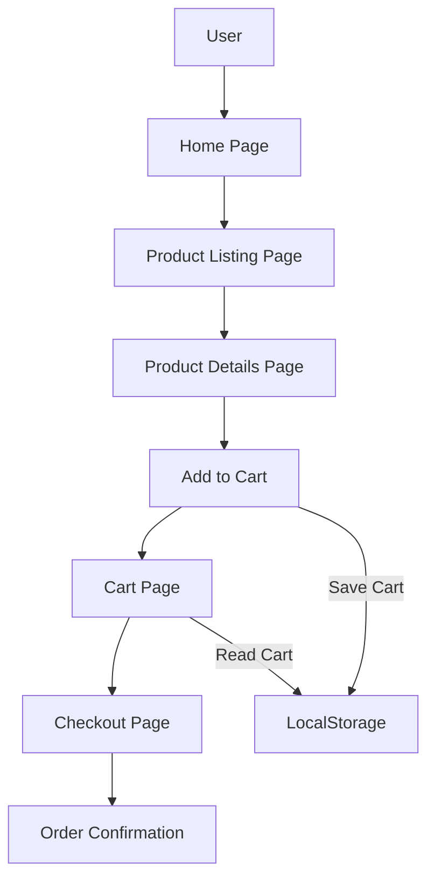
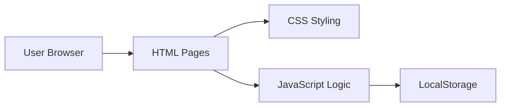

---

🛒 Simple E-Commerce Website

A beginner-friendly **simple e-commerce website** that demonstrates the core concepts of online shopping such as product listing, product details, cart management, and checkout flow.
This project is ideal for learning **HTML, CSS, and JavaScript fundamentals**.

---

📌 Features

* Home page with featured products
* Product listing page
* Product details page
* Add to Cart functionality
* Cart page with total price calculation
* Simple checkout flow (no real payment gateway)
* Responsive design (basic)

---

🧰 Technologies Used

* **HTML5** – Structure of the website
* **CSS3** – Styling and layout
* **JavaScript (Vanilla)** – Interactivity and logic
* **LocalStorage** – Store cart data on the browser

---

📂 Project Structure

```
ecommerce-website/
│
├── index.html          # Home page
├── products.html       # Products listing
├── cart.html           # Shopping cart
│
├── css/
│   └── style.css       # Main stylesheet
│
├── js/
│   ├── products.js     # Product data
│   ├── cart.js         # Cart logic
│   └── main.js         # General scripts
│
├── images/             # Product images
│
└── README.md           # Project documentation
```

---

🔄 System Flow Diagram (Complete)



---

🧠 Application Architecture Diagram



---

🚀 How to Run the Project

1. Clone the repository:

   ```bash
   git clone https://github.com/your-username/simple-ecommerce-website.git
   ```

2. Navigate to the project folder:

   ```bash
   cd simple-ecommerce-website
   ```

3. Open `index.html` in your browser
   *(No server required)*


📸 Screenshots (Optional)

Add screenshots here to show:

* Home Page
* Product Page
* Cart Page

Example:
```
/screenshots/home.png
/screenshots/cart.png
```
---

🛠️ Future Improvements

* User authentication (login/signup)
* Backend integration (Node.js / PHP)
* Database support (MySQL / MongoDB)
* Payment gateway integration
* Admin dashboard

📄 License

This project is **open source** and available under the **MIT License**.


🙌 Acknowledgements

* Inspired by basic e-commerce workflows
* Created for learning and educational purposes
